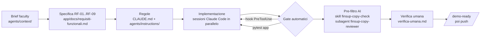

# Workflow: spec-driven development con Claude Code

1. **Contesto**: brief e regole del workshop consolidati in `agents/context/`. Non entrano nei prompt: Claude li legge solo quando servono.
2. **Specifica**: `app/docs/requisiti-funzionali.md`, scritta e validata dal team, è la fonte di verità. Ogni funzionalità cita il suo RF; se il codice deve divergere si aggiorna prima la specifica.
3. **Regole**: `CLAUDE.md` (mappa, comandi) importa le regole modulari di `agents/instructions/`: dominio, uso dell'AI, processo.
4. **Implementazione in parallelo**: più sessioni Claude Code sulla stessa working copy, ciascuna con file assegnati (per esempio: una sulla logica dell'app in `app/finsup/`, una su struttura, `agents/` e presentazione). Si coordinano prima di toccare file condivisi e committano solo path espliciti.
5. **Gate automatici**: l'hook `agents/hooks/check_financial_advice.py` blocca *in scrittura* qualsiasi file con linguaggio da consulente. `pytest app` copre guardrail, hook e logica di calcolo.
6. **Pre-filtro AI**: la skill `finsup-copy-check`, o il subagent `finsup-copy-reviewer` per più file in un contesto isolato, valuta i testi su consigli, significato e accessibilità.
7. **Verifica umana**: una persona legge i testi e annota l'esito in [verifica-umana.md](verifica-umana.md). A runtime l'utente conferma i dati estratti (RF-09).
8. **Freeze**: il comando `/demo-ready` (`agents/commands/demo-ready.md`) ripassa tutto, poi push.
